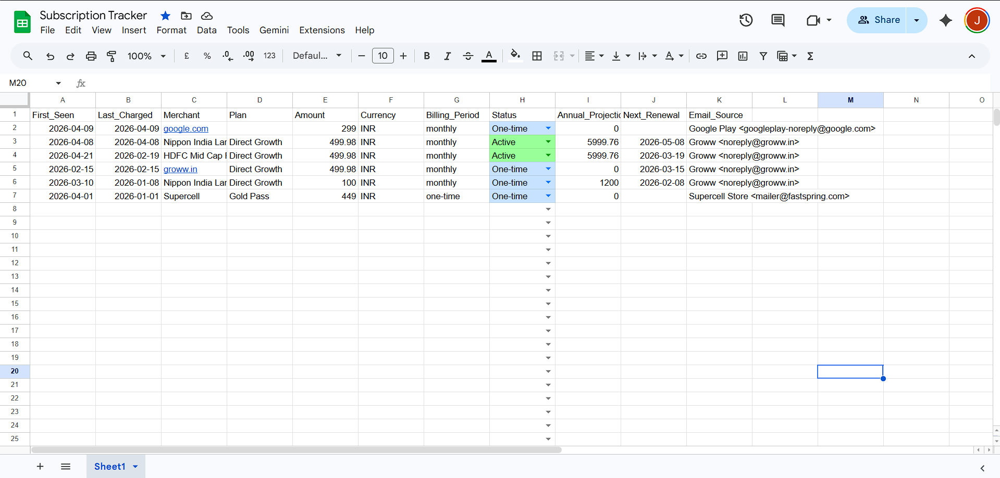
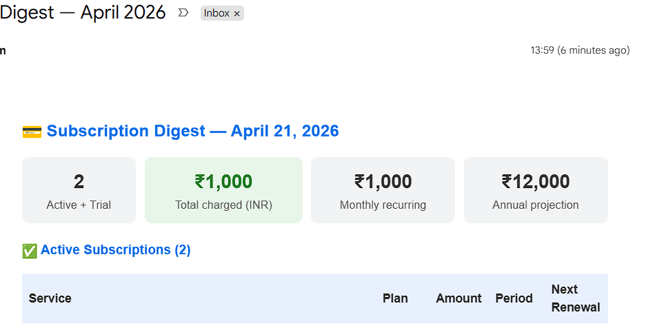

# Subscription & SaaS Spend Tracker Agent

An AI-powered agent that automatically tracks your SaaS subscriptions and billing spend — reads your Gmail, classifies receipts with LLMs, logs to Google Sheets, and emails a weekly digest.

> Zero manual input after setup. Works with any merchant globally.

## Features

- Fetches billing emails via Gmail API using targeted query + `label:purchases`
- Rule-based noise filter (no LLM cost) drops OTPs, MF statements, marketing
- AI classification: `Renewal` / `Trial` / `Cancelled` / `One-time` / `Noise`
- Hybrid extraction: regex pre-extractor for Indian receipts (₹, SIP) + LLM for everything else
- One row per merchant — deduplicates, updates in-place on re-charge
- Auto-calculates `Next_Renewal` from charge date when LLM can't determine it
- Google Sheets with colour-coded status, dropdown, sorted newest-first
- Weekly HTML digest: total spend, INR conversion, trial alerts, spend analysis by category
- LLM fallback chain: **Groq → Gemini 3.1 Flash Lite → Gemma 3 27B**
- `verify_llm.py` pre-flight check before running

---

## Screenshots

**Google Sheet — subscription tracker**


**Weekly Digest Email**


---

## Tech Stack

| Layer | Technology |
|---|---|
| Language | Python 3.10+ |
| LLM orchestration | [CrewAI](https://github.com/crewAIInc/crewAI) |
| LLM abstraction | [LiteLLM](https://github.com/BerriAI/litellm) |
| Prompt optimization | [DSPy](https://github.com/stanfordnlp/dspy) |
| Primary LLM | Groq `llama-3.3-70b-versatile` (free, 100k TPD) |
| Fallback LLM | Google `gemini-3.1-flash-lite-preview` (free, 500 RPD) |
| Second fallback | Google `gemma-3-27b-it` (free, 14.4k RPD) |
| Gmail | Gmail API v1 — OAuth 2.0 |
| Storage | Google Sheets API v4 — service account |
| Currency | [open.er-api.com](https://www.exchangerate-api.com) free tier |
| Config | `python-dotenv` |
| Scheduling | Windows Task Scheduler / cron |
| Container | Docker |

---

## Architecture

```
Gmail Inbox
    │
    ▼
fetch_emails()              ← Gmail API + SUBSCRIPTION_QUERY + label:purchases
    │
    ▼
is_noise_email()            ← Rule engine: sender domain + subject patterns (free, no LLM)
    │  pass
    ▼
looks_like_billing_email()  ← Keyword check
    │  pass
    ▼
classify_email()            ← CrewAI + Groq/Gemini → Renewal|Trial|Cancelled|One-time|Noise
    │
    ▼
_rule_based_extract()       ← Regex: ₹ amounts, SIP fields, fund names (fast, free)
    +
extract_billing_info()      ← CrewAI + LLM → merchant, amount, currency, period, renewal
    │
    ▼
Google Sheets               ← find_merchant_row() → upsert row, sort by Last_Charged desc
    │
    ▼  (Monday / --digest flag)
Weekly Digest Email         ← HTML: spend totals, INR conversion, trial alerts, analysis
```

---

## Project Structure

```
subscription-agent/
├── main.py                  # Orchestrator: fetch → filter → classify → extract → sheet
├── config.py                # Env vars and constants
├── requirements.txt
├── Dockerfile
├── verify_llm.py            # Pre-flight: check Groq + Gemini availability before run
├── sort_sheet.py            # One-time utility: sort existing sheet by Last_Charged
├── fix_state.py             # Utility: reset processed email state
│
├── agents/
│   └── classifier.py        # Email classification prompt + CrewAI agent
│
├── services/
│   ├── gmail.py             # Gmail OAuth, fetch, send
│   ├── sheets.py            # Sheets read/write, formatting, sort
│   └── digest.py            # Digest builder, INR conversion, spend analysis
│
├── core/
│   ├── extractor.py         # LLM extraction, rule-based extractor, retry + fallback
│   ├── rule_engine.py       # Noise filter, billing keyword detector, HTML sanitizer
│   └── state_manager.py     # state.json, dedup, Gemini quota tracking
│
└── logs/
    └── logger.py
```

---

## Setup Guide

### Step 1 — Clone and install

```bash
git clone <your-repo-url>
cd subscription-agent
pip install -r requirements.txt
```

### Step 2 — Get API keys

| Key | Where | Cost |
|---|---|---|
| Groq | [console.groq.com](https://console.groq.com) | Free |
| Gemini | [aistudio.google.com/app/apikey](https://aistudio.google.com/app/apikey) | Free |

### Step 3 — Create `.env`

```env
GROQ_API_KEY=gsk_xxxxxxxxxxxxxxxxxxxx
GEMINI_API_KEY=AIza_xxxxxxxxxxxxxxxxxxxx
MY_EMAIL=you@gmail.com
DIGEST_RECIPIENT=you@gmail.com
```

### Step 4 — Google Cloud setup

1. Go to [console.cloud.google.com](https://console.cloud.google.com) → New Project
2. Enable **Gmail API** and **Google Sheets API**
3. **OAuth consent screen** → External → add scopes:
   - `https://www.googleapis.com/auth/gmail.readonly`
   - `https://www.googleapis.com/auth/gmail.modify`
   - `https://www.googleapis.com/auth/gmail.send`
4. Add your Gmail as a test user
5. **Credentials → OAuth client ID** → Desktop app → download → rename to `client_secret.json`
6. **Credentials → Service Account** → create → Keys → JSON → rename to `credentials.json`
7. Copy the service account email

### Step 5 — Create Google Sheet

1. Create a Google Sheet named exactly: **`Subscription Tracker`**
2. Share it with the service account email → **Editor**

### Step 6 — First run

```bash
python main.py
```

A browser opens → sign in → allow access. Creates `token_account1.json` for all future runs.

---

## Running

```bash
# Process new billing emails
python main.py

# Send weekly digest only (without processing emails)
python main.py --digest
```

Check `app.log` for output:

```powershell
Get-Content app.log -Tail 30
```

---

## Automate with Windows Task Scheduler

1. Open **Task Scheduler** → **Create Basic Task**
2. Set trigger: **Daily**, repeat every **6 hours**
3. Action: **Start a Program**
   - Program: `"C:\Program Files\Python312\python.exe"`
   - Arguments: `main.py`
   - Start in: `E:\Tracker\subscription-agent`

For weekly digest, create a second task:
- Trigger: **Weekly** on Monday 9:00 AM
- Arguments: `main.py --digest`

---

## Running with Docker

```bash
docker build -t subscription-agent .
```

**Windows (PowerShell):**
```powershell
docker run --rm `
  -v "${PWD}/credentials.json:/app/credentials.json" `
  -v "${PWD}/client_secret.json:/app/client_secret.json" `
  -v "${PWD}/token_account1.json:/app/token_account1.json" `
  -v "${PWD}/state.json:/app/state.json" `
  -v "${PWD}/.env:/app/.env" `
  subscription-agent
```

---

## Google Sheet columns

| Column | Description |
|---|---|
| First_Seen | Date first receipt was detected |
| Last_Charged | Date of most recent charge |
| Merchant | Service name (Vercel, Notion, GitHub, etc.) |
| Plan | Plan tier (Pro, Team, Starter, etc.) |
| Amount | Latest charge amount |
| Currency | USD / INR / EUR etc. |
| Billing_Period | monthly / annual / one-time |
| Status | Active / Trial / Cancelled / One-time — colour coded |
| Annual_Projection | Amount × 12 if monthly, else the annual amount |
| Next_Renewal | Extracted renewal date |
| Email_Source | Sender email address |

### Status colour legend

| Status | Colour |
|---|---|
| Active | 🟢 Green |
| Trial | 🟡 Yellow |
| Cancelled | 🔴 Red |
| One-time | 🔵 Blue |

---

## LLM Fallback Chain

| Priority | Model | Trigger |
|---|---|---|
| 1 — Primary | Groq `llama-3.3-70b-versatile` | Default |
| 2 — Fallback | Google `gemini-3.1-flash-lite-preview` | Groq daily/per-minute limit |
| 3 — Second fallback | Google `gemma-3-27b-it` | Gemini 503 unavailable |

- Per-minute limits → waits the `retryDelay` from the error response, then retries
- Daily limits → immediately switches to next model for the rest of the run
- If all models are exhausted → email is skipped (not marked seen, reprocessed next run)
- Run `verify_llm.py` before `main.py` to confirm availability

---

## Observability — LangSmith

Full CrewAI traces (agents, tasks, LLM calls, latency, tokens) are sent to [LangSmith](https://smith.langchain.com) when the key is set.

### Setup

1. Sign up at [smith.langchain.com](https://smith.langchain.com) → copy your API key
2. Add to `.env`:

```env
LANGSMITH_API_KEY=ls__xxxxxxxxxxxxxxxxxxxx
LANGSMITH_PROJECT=subscription-tracker
```

3. Run normally — traces appear automatically, no code changes needed

Tracing is fully optional. If `LANGSMITH_API_KEY` is not set, the agent runs without it.

---

## Eval — Extraction Accuracy

A test suite of **60 labeled billing emails** (real + synthetic) is in `eval/test_cases.json`. Run it with:

```bash
uv run python eval/run_eval.py
```

### Latest results (DSPy optimized)

Prompt optimized with [DSPy](https://github.com/stanfordnlp/dspy) `BootstrapFewShotWithRandomSearch` using 4 few-shot demonstrations.

| Field | Accuracy |
|---|---|
| Merchant | 57/60 (95%) |
| Amount | 60/60 (100%) |
| Currency | 60/60 (100%) |
| Billing Period | 57/60 (95%) |
| **Overall** | **97.5%** |

**Improvement**: 83.8% → **97.5%** (+13.7 points) via DSPy prompt optimization.

Extraction uses a hybrid approach: regex pre-extractor for Indian receipts (SIP, ₹ amounts, fund names) with LLM as fallback. Rule-based results always win for `billing_period` to prevent LLM from misclassifying SIP deductions as `one-time`.

To add more test cases, append entries to `eval/test_cases.json` following the existing format.

---

## Contributing

Contributions are welcome! Here are good areas to improve:

- **New noise patterns** — add sender domains or subject keywords to `core/rule_engine.py`
- **New rule-based extractors** — add regex patterns to `_rule_based_extract()` in `core/extractor.py` for specific email formats
- **Additional LLM providers** — add a new model string to the fallback chain in `core/extractor.py` and `agents/classifier.py`
- **Multi-account support** — `authenticate_gmail()` accepts an `account_name` param, extend `main.py` to loop over accounts
- **Cron/Linux support** — add a cron setup guide to this README
- **Tests** — unit tests for `rule_engine.py`, `extractor.py` parsing, and `sheets.py` helpers

### Dev setup

```bash
git clone <repo-url>
cd subscription-agent
python -m venv .venv
.venv\Scripts\activate   # Windows
source .venv/bin/activate # Linux/Mac
pip install -r requirements.txt
cp .env.example .env      # fill in your keys
```

### Before submitting a PR

- Run `verify_llm.py` to confirm LLM connectivity
- Test with a small email batch (`max_results=5` in `gmail.py`)
- Do not commit `credentials.json`, `client_secret.json`, `token_*.json`, `.env`, or `state.json`

### Files that must never be committed

```
.env
credentials.json
client_secret.json
token_*.json
state.json
app.log
```

Ensure these are in `.gitignore` before pushing.
